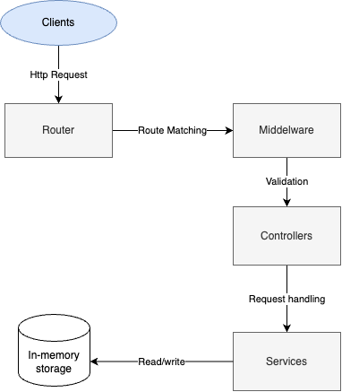

# short-url

A simple URL shortening service built using Node.js, TypeScript, Express, and Jest.



# Features
* Encode a URL to generate a shortened URL.
* Decode a shortened URL to retrieve the original URL.
* Swagger documentation generated using OpenAPI YAML.

# Project Structure

- **index.ts**: The entry point of the application.
- **controllers/**: Handles incoming HTTP requests and sends responses.
- **service/**: Contains the core business logic of the application.
- **middleware/**: Express middleware for request processing.
- **routes/**: Defines API endpoints and routes.
- **exceptions/**: Custom error handling and exception classes.
- **utils/**: Utility and helper functions.
- **tests/**: Jest tests for unit and integration testing.
- **docs/**: Swagger documentation for API endpoints.

# API Documentation

Swagger documentation is generated using OpenAPI YAML and is available at the `/docs` endpoint.
```bash
http://localhost:3000/docs
```

# Local Development
## Prerequisites

- Node.js (latest LTS version)
- npm

### Installation

1. Clone the repository.
2. Install dependencies:

    ```bash
    npm install
    ```

3. Set up environment variables:

    Copy .env.example to .env:

    ```bash
    cp .env.example .env
    ```

## Running the Service

Start the service locally:

```bash
npm run dev
```

## Running Tests

Jest is used for testing. Run the tests with:
```bash
npm run test
```

# Production

1. To compile the TypeScript code into JavaScript for production, run:

    ```bash
    npm run build
    ```
    This will generate a dist folder containing the compiled JavaScript files.

2. Running in Production
After building the project, start the production server with:
    ```bash
    npm run build
    ```
    This will run the compiled JavaScript files from the `dist` folder.
